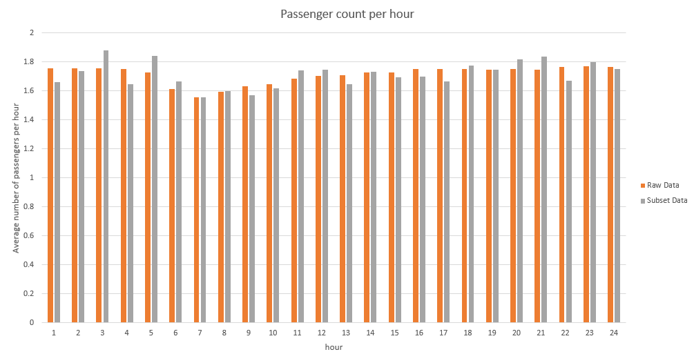

# IA626
1. In the first part of my project I wrote some code to open csv files:
<br>
```python
starttime = time.time()
fn = 'trip_data_12.csv'

f2 = open('subset_data_12.csv','w')
f2.write("")
f2.close()

f = open(fn, "r")
reader = csv.reader(f)
f2 = open('subset_data_12.csv','a')
writer = csv.writer(f2, delimiter=',', lineterminator='\n')
```
<br>
2. I defined two lists for mean passenger count calculation:
<br>
```python
#Define a list to contain no of values recorded per hour
hours_no_values = [[0 for i in range(24)] for j in range(2)]

#Define a list to contain mean passenger count stats per hour
mean_pc_stats = [[0 for i in range(24)] for j in range(2)]
```
<br>



