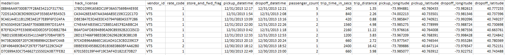
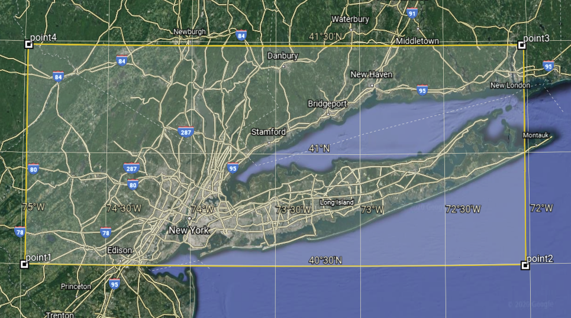

# IA626
*****************
Code descriptions
*****************
In the first part of my project I wrote some code to open csv files:
<br>
```python
starttime = time.time()
fn = 'trip_data_12.csv'

f2 = open('subset_data_12.csv','w')
f2.write("")
f2.close()

f = open(fn, "r")
reader = csv.reader(f)
f2 = open('subset_data_12.csv','a')
writer = csv.writer(f2, delimiter=',', lineterminator='\n')
```
I defined two lists for mean passenger count calculation and three lists to contain the distinct values:
<br>
```python
#Define a list to contain no of values recorded per hour
hours_no_values = [[0 for i in range(24)] for j in range(2)]

#Define a list to contain mean passenger count stats per hour
mean_pc_stats = [[0 for i in range(24)] for j in range(2)]

#Define lists to contain the distinct values for vendor_id, rate_code and 
# passenger_count.
vendor_id, rate_code, passenger_count = [], [], []
```
I used dateutil.parser module to grab the datetime for comparision:
<br>
```python
fdt_pickup = datetime.strptime(row[5], '%Y-%m-%d %H:%M:%S')
fdt_dropoff = datetime.strptime(row[6], '%Y-%m-%d %H:%M:%S')

min_pickup_datetime = dateutil.parser.parse(str(fdt_pickup))
max_dropoff_datetime = dateutil.parser.parse(str(fdt_dropoff))
```
Grabbed the distinct values for vendor_id, rate_code and passenger_count:
<br>
```python
if row[2] not in vendor_id:
    vendor_id.append(row[2])
if row[3] not in rate_code:
    rate_code.append(row[3])
if row[7] not in passenger_count:
    passenger_count.append(row[7])
```
Assigned the values to min/max variables with the first recorded data:
<br>
```python
if n == 1:
    min_rate_code = int(row[3])
    max_rate_code = int(row[3])

    min_pickup_datetime = dateutil.parser.parse(str(fdt_pickup))
    max_dropoff_datetime = dateutil.parser.parse(str(fdt_dropoff))
    
    min_passenger_count = int(row[7])
    max_passenger_count = int(row[7])
    
    min_trip_time_in_secs = int(row[8])
    max_trip_time_in_secs = int(row[8])
    
    min_trip_distance = float(row[9])
    max_trip_distance = float(row[9])
    
    min_pickup_longitude = float(row[10])
    max_pickup_longitude = float(row[10])
    
    min_pickup_latitude = float(row[11])
    max_pickup_latitude = float(row[11])
    
    min_dropoff_longitude = float(row[12])
    max_dropoff_longitude = float(row[12])
    
    min_dropoff_latitude = float(row[13])
    max_dropoff_latitude = float(row[13])
```
Compared the new data with the min/max variables and updated them with the less/greater data:
<br>
```python
else:
    if int(row[3]) > max_rate_code:
        max_rate_code = int(row[3])
    if int(row[3]) < min_rate_code:
        min_rate_code = int(row[3])
        
    if dateutil.parser.parse(str(fdt_dropoff)) > max_dropoff_datetime:
        max_dropoff_datetime = dateutil.parser.parse(str(fdt_dropoff))
    if dateutil.parser.parse(str(fdt_pickup)) < min_pickup_datetime:
        min_pickup_datetime = dateutil.parser.parse(str(fdt_pickup))
        
    if int(row[7]) > max_passenger_count:
        max_passenger_count = int(row[7])
    if int(row[7]) < min_passenger_count:
        min_passenger_count = int(row[7])
        
    if int(row[8]) > max_trip_time_in_secs:
        max_trip_time_in_secs = int(row[8])
    if int(row[8]) < min_trip_time_in_secs:
        min_trip_time_in_secs = int(row[8])
        
    if float(row[9]) > max_trip_distance:
        max_trip_distance = float(row[9])
    if float(row[9]) < min_trip_distance:
        min_trip_distance = float(row[9])
```
Used latitude range from 40.5 to 41.5 and longitude range from -75 to -72 to filter out the outliers from lat-long cooordinates for New York city area:
<br>
```python
try:
    pickup_longitude = float(row[10])
except ValueError:
    print(row[10] + ' is not a valid longitude!')
    pickup_longitude = min_pickup_longitude
    
if pickup_longitude > -75 and pickup_longitude < -72:
    if pickup_longitude > max_pickup_longitude:
        max_pickup_longitude = pickup_longitude
    if pickup_longitude < min_pickup_longitude:
        min_pickup_longitude = pickup_longitude
 else:
     print(str(pickup_longitude) + ' is out of the range!')

try:
    pickup_latitude = float(row[11])
except ValueError:
    print(row[11] + ' is not a valid latitude!')
    pickup_latitude = min_pickup_latitude
    
if pickup_latitude > 40.5 and pickup_latitude < 41.5:
    if min_pickup_latitude > max_pickup_latitude:
        max_pickup_latitude = pickup_latitude
    if min_pickup_latitude < min_pickup_latitude:
        min_pickup_latitude = pickup_latitude
 else:
     print(str(pickup_latitude) + ' is out of the range!')

try:
    dropoff_longitude = float(row[12])
except ValueError:
    print(row[12] + ' is not a valid longitude!')
    dropoff_longitude = min_dropoff_longitude
    
if dropoff_longitude > -75 and dropoff_longitude < -72:
    if dropoff_longitude > max_dropoff_longitude:
        max_dropoff_longitude = dropoff_longitude
    if dropoff_longitude < min_dropoff_longitude:
        min_dropoff_longitude = dropoff_longitude
 else:
     print(str(dropoff_longitude) + ' is out of the range!')
 
try:
    dropoff_latitude = float(row[13])
except ValueError:
    print(row[13] + ' is not a valid latitude!')
    dropoff_latitude = min_dropoff_latitude
    
if dropoff_latitude > 40.5 and dropoff_latitude < 41.5:
    if dropoff_latitude > max_dropoff_latitude:
        max_dropoff_latitude = dropoff_latitude
    if dropoff_latitude < min_dropoff_latitude:
        min_dropoff_latitude = dropoff_latitude
 else:
     print(str(dropoff_latitude) + ' is out of the range!')

```
Devided the passenger count by passenger count stats to calculate the mean value per hour:
<br>
```python
for i in range(0, 24):
    if(hours_no_values[1][i] != 0):
        mean_pc_stats[1][i] = mean_pc_stats[1][i]/hours_no_values[1][i]    
    else:
        mean_pc_stats[1][i] = 0
    
    print("hour %2d: %2.3f" % (i, mean_pc_stats[1][i]))
```
Compared the min/max latitude and longitude from pickup and dropoff lat-long:
<br>
```python
if min_pickup_latitude < min_dropoff_latitude:
    min_latitude = min_pickup_latitude
else:
    min_latitude = min_dropoff_latitude

if min_pickup_longitude < min_dropoff_longitude:
    min_longitude = min_pickup_longitude
else:
    min_longitude = min_dropoff_longitude
    
if max_pickup_latitude > max_dropoff_latitude:
    max_latitude = max_pickup_latitude
else:
    max_latitude = max_dropoff_latitude

if max_pickup_longitude > max_dropoff_longitude:
    max_longitude = max_pickup_longitude
else:
    max_longitude = max_dropoff_longitude
    
print("Min latitude: " + str(min_latitude))
print("Max latitude: " + str(max_latitude))
print("Min longitude: " + str(min_longitude))
print("Max longitude: " + str(max_longitude))
```
************************
Answers to the questions
************************
1.	What time range does your data cover?
<br>From 12/1/2013  12:00:00 AM to 1/3/2014  4:31:27 PM
2.	How many rows are there total?
<br>13971118
3.	What are the field names? Give descriptions for each field.
<br>medallion: also known as a CPNC (Certificate of Public Necessity and Convenience), is a transferable permit in the United States allowing a taxicab driver to operate.
<br>hack_license: it is known as a New York City Taxi Operators License.
<br>vendor_id: A designation for the technology vendor that provided the record. CMT=Creative Mobile Technologies VTS= VeriFone, Inc.
<br>rate_code: Standard City Rate (Rate Code 1), for trips between (to and from) Manhattan and JFK International Airport, uses Rate Code 2 on the meter.
<br>store_and_fwd_flag: store and forward flag.
<br>pickup_datetime: date and time for pickup
<br>dropoff_datetime: date and time for dropoff
<br>passenger_count: how many passengers
<br>trip_time_in_secs: how long did the trip take in seconds
<br>trip_distance: the distance of the trip
<br>pickup_longitude: the longitude of pickup location
<br>pickup_latitude: the latitude of pickup location
<br>dropoff_longitude: the longitude of dropoff location
<br>dropoff_latitude: the latitude of dropoff location
4.	Give some sample data for each field.

5.	What MySQL data types would you need to store each of the fields?
<br>medallion: varchar(50)
<br>hack_license: varchar(50)
<br>vendor_id: varchar(5)
<br>rate_code: int(10)
<br>store_and_fwd_flag: varchar(5)
<br>pickup_datetime: datetime
<br>dropoff_datetime: datetime
<br>passenger_count: int(10)
<br>trip_time_in_secs: int(10)
<br>trip_distance: decimal(5,2)
<br>pickup_longitude: decimal(8,6)
<br>pickup_latitude: decimal(8,6)
<br>dropoff_longitude: decimal(8,6)
<br>dropoff_latitude: decimal(8,6)
6.	What is the geographic range of your data (min/max - X/Y)?
<br>Min latitude: 40.500240
<br>Max latitude: 41.487167
<br>Min longitude: -74.974403
<br>Max longitude: -72.026741

7.	What are the distinct values for each field? (If applicable)
<br>vendor_id: ['VTS', 'CMT']
<br>rate_code: ['1', '2', '3', '5', '4', '0', '8', '6', '13', '210', '7', '9', '65', '15']
<br>passenger_count: ['1', '6', '5', '3', '4', '2', '7', '0', '8', '9']
8.	For other numeric types besides lat and lon, what are the min and max values?
<br>Min rate_code: 0
<br>Max rate_code: 210
<br>Min passenger_count: 0
<br>Max passenger_count: 9
<br>Min trip_time_in_secs: 0
<br>Max trip_time_in_secs: 10800
<br>Min trip_distance: 0
<br>Max trip_distance: 100
9.	Create a chart which shows the average number of passengers each hour of the day.
<br>See plot below.
10.	Create a new CSV file which has only one out of every thousand rows.
11.	Repeat step 9 with the reduced dataset and compare the two charts.
<br>See plot below.


